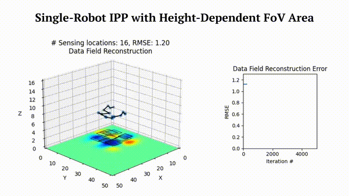

 [**Github Repo**](https://github.com/itskalvik/sgp-tools)

SGP-Tools is a software suite for SGP-based [Sensor Placement](https://itskalvik.com/publication/sgp-sp) (SP) and [Informative Path Planning](https://itskalvik.com/publication/sgp-ipp) (IPP).

## Method Demos
<p align="center"></p>

## Method Summary
<p align="center"><div class="video-con"><iframe width="560" height="315" src="https://www.youtube.com/embed/G-RKFa1vNHM?si=PLmrmkCwXRj7mc4A" title="YouTube video player" frameborder="0" allow="accelerometer; autoplay; clipboard-write; encrypted-media; gyroscope; picture-in-picture; web-share" referrerpolicy="strict-origin-when-cross-origin" allowfullscreen></iframe></div></p>

## About
The library is based on the following papers:

```
@misc{JakkalaA23SP,
AUTHOR={Kalvik Jakkala and Srinivas Akella},
TITLE={Efficient Sensor Placement from Regression with Sparse Gaussian Processes in Continuous and Discrete Spaces},
NOTE= {Preprint},
YEAR={2023},
URL={https://itskalvik.github.io/publication/sgp-sp},
}

@inproceedings{JakkalaA24IPP,
AUTHOR={Kalvik Jakkala and Srinivas Akella},
TITLE={Multi-Robot Informative Path Planning from Regression with Sparse Gaussian Processes},
booktitle={IEEE International Conference on Robotics and Automation, {ICRA}},
YEAR={2024},
PUBLISHER = {{IEEE}},
URL={https://itskalvik.github.io/publication/sgp-ipp}
}
``` 

## Acknowledgements
This work was funded in part by the UNC Charlotte Office of Research and Economic Development and by NSF under Award Number IIP-1919233.

## License
The SGP-Tools software suite is licensed under the terms of the Apache License 2.0.
See LICENSE for more information.